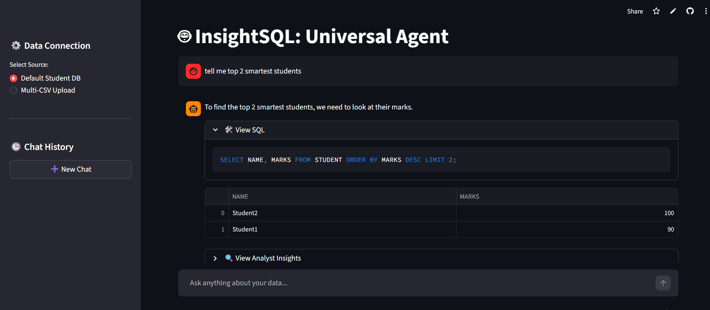

# 🤖 InsightSQL: Universal Natural Language to SQL Agent

> **Turn plain English into powerful data queries — no SQL knowledge required.**

InsightSQL is an AI-powered data analyst that lets anyone search through SQLite databases and CSV files using simple, conversational language. Built with Python, LangChain, and Streamlit — deployed on Streamlit Cloud.

---

## 📸 Demo



> Ask questions like *"Show me the top 3 students by marks"* or *"How many students are in Data Science?"* — and get instant results, SQL transparency, and AI-generated insights.

---

## ✨ Features

| Feature | Description |
|---|---|
| 🗣️ Natural Language Queries | Ask questions in plain English — no SQL needed |
| 🗄️ Multi-Source Support | Works with SQLite databases **and** uploaded CSV files |
| 🧠 Session Memory | Remembers past interactions and handles follow-up questions |
| 📜 Chat History | Save, revisit, and continue past conversations |
| 🔍 SQL Transparency | View the generated SQL query in an expandable dropdown |
| 📊 Analyst Insights | AI-powered pattern analysis on your query results |
| 📥 Downloadable Results | Export query results as new files |
| ☁️ Cloud Deployed | Fully hosted on Streamlit Cloud — no local setup needed |

---

## 🛠️ Tech Stack

- **Language:** Python 3.10+
- **AI / LLM:** [LangChain](https://www.langchain.com/) + [Groq API](https://groq.com/) (`llama-3.3-70b-versatile`)
- **Frontend / UI:** [Streamlit](https://streamlit.io/)
- **Database:** SQLite (default) + in-memory SQLite for CSVs
- **Data Processing:** Pandas
- **Deployment:** Streamlit Cloud

---

## 📁 Project Structure

```
text-to-sql/
│
├── .streamlit/
│   └── secrets.toml          # API keys (never commit this)
│
├── .vscode/                  # Editor settings
├── .env                      # Local environment variables
├── .gitignore
│
├── database.py               # DB initialization — creates student.db with sample data
├── main.py                   # Main Streamlit app — UI, agent, query engine
│
├── student.db                # SQLite database (auto-generated)
├── requirements.txt          # Python dependencies
├── Pipfile / Pipfile.lock    # Pipenv dependency files
└── README.md
```

---

## ⚙️ Setup & Installation

### 1. Clone the Repository

```bash
git clone https://github.com/your-username/text-to-sql.git
cd text-to-sql
```

### 2. Install Dependencies

Using pip:
```bash
pip install -r requirements.txt
```

Or using Pipenv:
```bash
pipenv install
pipenv shell
```

### 3. Set Up Your API Key

Create a `.streamlit/secrets.toml` file:

```toml
GROQ_API_KEY = "your_groq_api_key_here"
```

Or set it as an environment variable in `.env`:

```env
GROQ_API_KEY=your_groq_api_key_here
```

> 💡 Get a free Groq API key at [console.groq.com](https://console.groq.com)

### 4. Initialize the Database

```bash
python database.py
```

This creates `student.db` with a sample `STUDENT` table containing 5 records.

### 5. Run the App

```bash
streamlit run main.py
```

Open your browser at `http://localhost:8501`

---

## 🚀 Usage

### Option A — Default Student Database

The app comes pre-loaded with a sample student database. Just launch the app and start asking questions:

```
"How many students are there?"
"Show me students with marks above 80"
"Who scored the highest in Data Science?"
"What is the average score per course?"
```

### Option B — Upload Your Own CSV Files

1. In the sidebar, select **"Multi-CSV Upload"**
2. Upload one or more `.csv` files
3. The app auto-creates in-memory SQLite tables from your CSVs
4. Ask questions referencing your data naturally

### Chat History

- Use **➕ New Chat** to start a fresh conversation (the current chat is archived automatically)
- Click any past chat in the sidebar to revisit it
- The agent uses the last 3 messages as context for follow-up questions

---

## 🧠 How It Works

```
User Question (Natural Language)
        │
        ▼
  LangChain + Groq LLM
  (llama-3.3-70b-versatile)
        │
        ▼
   SQL Query Generated
        │
        ▼
  SQLite Execution (live DB or in-memory CSV)
        │
        ▼
  Results → DataFrame → Display
        │
        ▼
  Analyst LLM → Pattern Insights (optional)
```

The agent follows semantic rules to handle ambiguous queries correctly:
- *"How many students?"* → `COUNT(*)` not `MAX()`
- *"Highest marks"* → `MAX(MARKS)` not `COUNT(*)`
- *"Top 3 students"* → `ORDER BY MARKS DESC LIMIT 3`

---

## 📦 Requirements

```
streamlit
langchain
langchain-groq
pandas
python-dotenv
```

Full list in `requirements.txt`.

---

## 🌐 Deployment (Streamlit Cloud)

1. Push your project to a public GitHub repository
2. Go to [share.streamlit.io](https://share.streamlit.io) and connect your repo
3. Set `GROQ_API_KEY` in the **Secrets** section of the Streamlit Cloud dashboard
4. Deploy — the app goes live instantly

> ⚠️ Make sure `student.db` is included in your repo, or run `database.py` as part of your startup logic.

---

## 🔒 Security Notes

- Never commit your `secrets.toml` or `.env` file — both are listed in `.gitignore`
- API keys are loaded via `st.secrets` (cloud) or `os.getenv` (local)
- No user data is stored persistently — CSV uploads are loaded into in-memory SQLite and cleared on session end

---

## 🤝 Contributing

Contributions are welcome! To contribute:

1. Fork the repo
2. Create a feature branch: `git checkout -b feature/your-feature`
3. Commit your changes: `git commit -m 'Add some feature'`
4. Push to the branch: `git push origin feature/your-feature`
5. Open a Pull Request

---

## 📄 License

This project is licensed under the MIT License. See [LICENSE](LICENSE) for details.

---

## 👨‍💻 Author

Built with ❤️ using Python, LangChain, and Streamlit.

If you found this project helpful, please ⭐ star the repository!